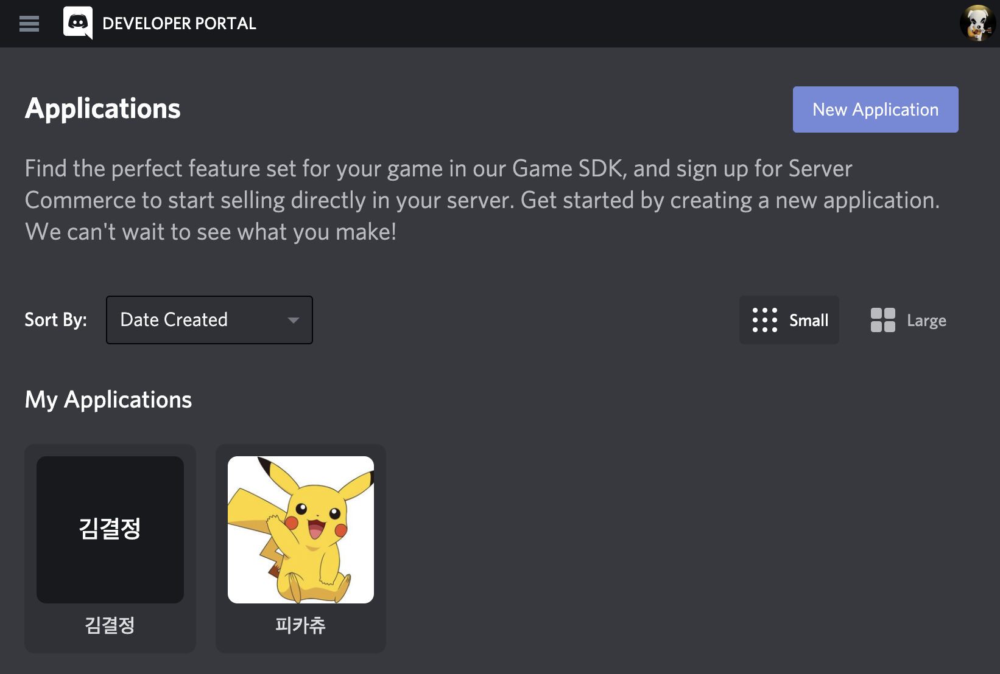
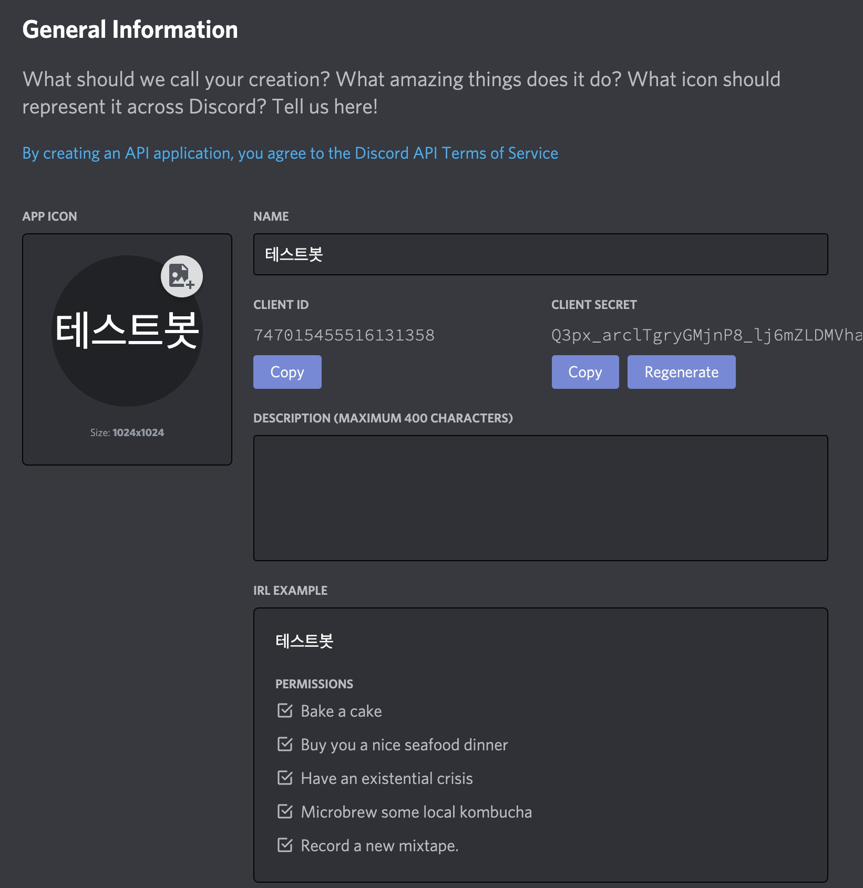

# 준비 : 디스코드 봇 생성




`New Application` 클릭

이름정하고 `General Information` 입력 페이지 이동



클라이언트 ID와 Auth Token을 확인할 수 있음. (CLIENT SECRET)

Client Secret 키는 유출되면 안됨.
만약 타인에게 유출되었을 경우 Regenerate 눌러서 재발급 받으면 됨


이걸로 디스코드 앱 등록은 간단히 해결됨


# 시작 : 프로젝트 구조 확인

```bash
discord_bot
├── command
│   ├── asset
│   ├── keyword_manager.py
│   ├── keywords.py
│   ├── please_make_decision.py
│   ├── russian_roulette.py
│   └── weather.py
├── requirements.txt
├── run.py
├── settings.py
└── sql_driver.py
```

| 파일명                          | 설명                                                         |
| ------------------------------- | ------------------------------------------------------------ |
| run.py                          | 디스코드 봇의 메시지 이벤트가 발생할 때 체크하여<br />command 안에 있는 기능실행 |
| settings.py                     | Bot의 설정 관련 정보가 위치하는 파일<br />각종 환경변수도 여기서 긁어온다.<br />환경변수 설정이 귀찮다면 직접 넣어줘도되지만 권장안함. |
| sql_driver.py                   | Python으로 MySQL DB에 접근하는 것을<br />간소화하기위해 만들어둔 모듈 |
| command/keyword_manager.py      | keywords.py: 키워드 검색<br />keyword_manager.py: 키워드 추가/제거/변경<br />키워드 관련 작업을 위해 만들어진 모듈 |
| command/please_make_decision.py | 0,1 사이 랜덤값으로 ㅇㅇ, ㄴㄴ를 출력하는 의사결정모듈       |
| command/russian_roulette.py     | 러시안룰렛 게임을 위해 만들어진 모듈                         |
| command/weather.py              | 네이버 날씨 정보를 긁어오는 모듈                             |
| requirements.txt                | 실행에 필요한 의존성 해결을 위한 패키지리스트<br />참조하여 패키지 설치해주면됨 |
|                                 |                                                              |


간단하게 `command`안에 예제모듈 몇 개 만들어놓았음.

> 나름대로의 best practice라고 생각해서 만든 구조인데 키워드 라우팅하는 부분이 맘에안드네요..
>
> 괜찮은 방법이 있다면 PR 부탁드려요.


# 봇 기본 실행 예제

```python
import discord
import asyncio

token = '개발자 페이지에서 확인한 클라이언트 토큰값 넣어주면됨'
client = discord.Client()

@client.evnet
async def on_message(message):
  if message.author.name == '봇 이름':
    print('여기서는 봇이 전달하는 메시지로 뭔가 할 수 있어요')
  else:
    print('여기서는 사용자가 전달하는 메시지로 뭔가 할 수 있어요')
    if '안녕' in message.content:
      # '안녕'이라는 문자열이 메시지에 포함되어있으면
      # 채널에 메시지 전달
      await message.channel.send('응 반가워!')
      
# 클라이언트 실행
client.run(token)
```


## 메시지 핸들링

채팅방에 봇이 초대된 이후 봇을 실행하면

채팅 이벤트가 발생할 때 마다 채팅내용 `message.content`을 확인하고 정해진 기능을 수행하고 사용자에게 결과를 반환한다

`run.py`의 `async def on_message(message)` 함수를 참조

```python
@client.event
async def on_message(message):
	... # blah blah
```


## 키워드 저장용 데이터베이스

봇이 알아들을만한 키워드를 채팅방에서 등록하기위해 몇 가지 작업을 했는데

매번 파일에 접근하는 것은 비효율적이라고 생각하여 데이터베이스에 저장하기로 했다.

데이터베이스 관련 환경변수는 문의바람.


# How to play

Python3 설치되었다는 가정하에..진행

## 환경변수 설정

```bash
vi ~/.bashrc
```

```bash
# >>> DISCORD >>>
export DISCORD_TOKEN='생성해서 받아놓은 클라이언트 토큰 입력'
# <<< DISCORD <<<

# >>> DB Settings >>>
export L_MYSQL_DB_NAME='봇 이름 입력하세요'
export L_MYSQL_DB_USER='DB ID 입력'
export L_MYSQL_DB_PASSWORD='DB PASSWORD 입력'
export L_MYSQL_DB_HOST='MySQL DB Endpoint 주소 입력'
export L_MYSQL_DB_PORT='MySQL DB Port 입력, 기본 포트는 3306'
# <<< DB Settings <<<
```


## 패키지 설치 및 실행

```bash
pip3 install -r requirements.txt
python3 run.py
```


